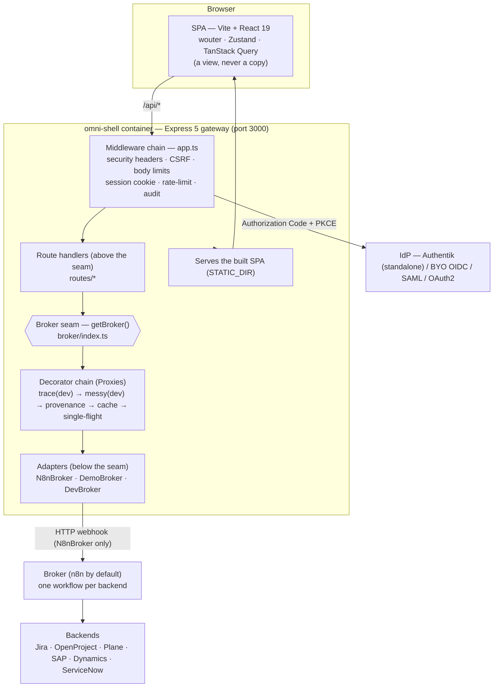
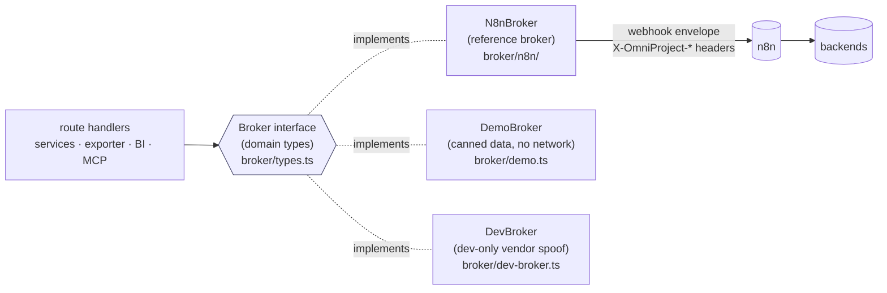
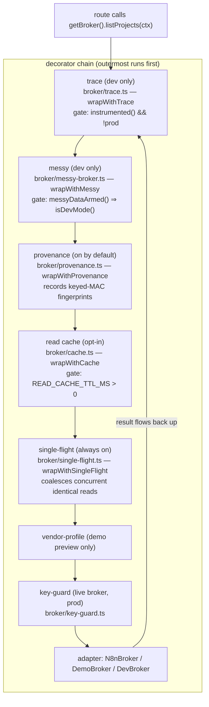

# OmniProject — Architecture (for auditors & new engineers)

> **Read this first, then [READING-GUIDE.md](READING-GUIDE.md).** This document is
> the one-sitting overview: the stateless / zero-at-rest model, the layer cake,
> the broker seam, where config lives, and the security spine. Every claim below
> is cross-checked against the code and cites the file it lives in (paths are
> clickable). The per-function index is [FUNCTION-MAP.md](FUNCTION-MAP.md); the
> published southbound contract is [CONTRACT.md](CONTRACT.md); the boundary
> invariants the build enforces are in [BROKER.md](BROKER.md).

---

## 1. The one-paragraph model

OmniProject is a **stateless, zero-at-rest overlay** over your existing PM/PgM
backends (Jira, OpenProject, Plane, ServiceNow, SAP, Dynamics …). It **stores no
project data**: every read and write is brokered *live* to the real backend
through a single **`Broker` interface** — so the backend stays the single source
of truth and there is no cached copy to drift. The only thing the gateway keeps
is a **signed, sealed, httpOnly session cookie** wrapping the IdP tokens;
horizontal scaling needs only a shared `SESSION_SECRET`. Above the broker seam the
codebase is *structurally incapable* of knowing the broker is n8n — a CI
architecture-guard fails the build if any n8n-ism leaks across the seam
([`broker-guard.test.ts`](../artifacts/api-server/src/__tests__/broker-guard.test.ts)).

**Zero-at-rest, concretely** — the two decorators that could put data on the
server are gated:

- The **read cache** ([`broker/cache.ts`](../artifacts/api-server/src/broker/cache.ts))
  is OFF by default (`READ_CACHE_TTL_MS` unset), per-actor keyed, write-through,
  bounded (`MAX_ENTRIES = 2000`), RAM-only, and flagged loudly at boot when armed.
- The **provenance chain** ([`lib/provenance.ts`](../artifacts/api-server/src/lib/provenance.ts))
  keeps only keyed-MAC *fingerprints* of each call, never the content (a bounded
  in-memory ring, `RING_MAX = 500`).

Everything else that touches project data is in transit only.

---

## 2. The layer cake



**The layers, top to bottom:**

| Layer | Where | What it is |
| ----- | ----- | ---------- |
| **SPA (shell)** | [`artifacts/omniproject/`](../artifacts/omniproject/) | Static React 19 app. In prod the gateway serves it; in dev Vite proxies `/api`. It is a *view* — it holds no authoritative state. |
| **Gateway middleware** | [`artifacts/api-server/src/app.ts`](../artifacts/api-server/src/app.ts) | Compression, IP allowlist, cookie-parser, sliding session timeout, CSRF guard, body limits, request logging/timing, then mounts the `/api` router. |
| **Route handlers** | [`artifacts/api-server/src/routes/`](../artifacts/api-server/src/routes/) | Domain-facing. They only ever call `getBroker()` + the `Broker` interface — never a concrete adapter. |
| **Broker seam** | [`artifacts/api-server/src/broker/index.ts`](../artifacts/api-server/src/broker/index.ts) | Picks the implementation once and wraps it in the decorator chain (§4). |
| **Adapters** | [`broker/n8n/`](../artifacts/api-server/src/broker/n8n/) · [`demo.ts`](../artifacts/api-server/src/broker/demo.ts) · [`dev-broker.ts`](../artifacts/api-server/src/broker/dev-broker.ts) | The only code that knows a real backend/broker exists. All n8n specifics are confined here. |
| **Broker + backends** | external | n8n (reference broker) runs one workflow per backend and forwards the user's own token. |

---

## 3. The broker seam (the load-bearing boundary)

Everything above the seam calls `getBroker()` and speaks the `Broker` interface
([`broker/types.ts`](../artifacts/api-server/src/broker/types.ts)) in OmniProject's
own domain vocabulary. Two implementations ship; a third is dev-only:

- **`N8nBroker`** — the reference broker; the **only** n8n-aware code. Maps
  domain methods (`listProjects`, `writeIssue`, …) to n8n actions
  (`list_projects`, `create_issue`, …), builds the webhook envelope, computes the
  idempotency key, stamps `origin` for the loop-guard, and normalises the
  response.
- **`DemoBroker`** — an in-process broker serving canned sample data with no
  network. It is both the offline/CI harness and the *proof the seam is clean*:
  the whole gateway runs against it.
- **`DevBroker`** — dev-only; presents *as* a chosen vendor over a chosen data
  source (demo/bundle/cassette). `devBrokerFromEnv()` returns null outside dev mode.



**Invariants the CI guard enforces** (from
[`broker-guard.test.ts`](../artifacts/api-server/src/__tests__/broker-guard.test.ts),
documented in [BROKER.md](BROKER.md)):

1. The data-path modules contain **zero** n8n references (a `PRISTINE` allow-list).
2. The legacy n8n call API (`callN8n`, `isN8nConfigured`, `N8nError`, …) never
   appears outside `src/broker/`.
3. **Nothing above the seam imports the adapter directly** — the adapter-import
   allow-list is *empty*. The command edges go through the neutral
   `brokerCommand()` helper exported from the broker barrel.

So "swap the broker if n8n is superseded" is a property the build *enforces*: write
`FooBroker implements Broker`, point the selector at it, delete the n8n adapter, and
nothing above the seam moves.

---

## 4. The decorator chain (a broker READ, layer by layer)

`getBroker()` selects the adapter once, then wraps it in a stack of transparent
`Proxy` decorators. Reading
[`broker/index.ts`](../artifacts/api-server/src/broker/index.ts) top to bottom, the
composition wraps **outward** (each line re-assigns `base = wrap(base)`), so the
*outermost* wrap runs *first* on the way in:



Why this order (all documented inline in `index.ts`):

- **single-flight** is innermost of the caches so a cache hit never reaches it; it
  introduces **no staleness** (coalesced callers share one live result), so it is
  safe on unconditionally and shields the backend from a thundering herd.
- **cache** sits above single-flight so a hit short-circuits both; it is the one
  feature that briefly puts data in RAM, so it is opt-in and write-through.
- **provenance** sits *outside* the cache so every logical call is fingerprinted
  even on a cache hit.
- **messy** (dev chaos) is the outermost *data* transform so it sees the final
  rows, but *inside* trace so a trace shows the messified payload.
- **trace** is outermost so it observes everything, and is inert in production.

A key subtlety: the **key-guard** is innermost (`wrapWithKeyGuard`) so a cache hit —
which reaches no broker — is never blocked; a keyless request can never reach a
*live* vendor outside dev mode (`BROKER_PSK` required).

---

## 5. Where configuration lives

OmniProject versions its own **configuration** (never project data). Three tiers:

| Tier | Source | Notes |
| ---- | ------ | ----- |
| **Env vars** | process env | Boot-time wiring: `BROKER_URL`, `OIDC_*`, `SESSION_SECRET`, `CAPABILITIES`, `READ_CACHE_TTL_MS`, `API_TOKENS`, … (see the README config table). |
| **JSON catalogues** | [`lib/backend-catalogue`](../lib/backend-catalogue/) | The seven **integration-plane** registries (backends, brokers, outputs, notifications, methodologies, reports, screens) — vendor-neutral manifests authored as JSON under `assets/`, embedded + drift-guarded in CI. The **field vocabulary** (`assets/fields.json` → `FIELD_REGISTRY`) is the canonical work-item superset. |
| **Settings store** | [`lib/settings.ts`](../artifacts/api-server/src/lib/settings.ts) + [`lib/config-store.ts`](../artifacts/api-server/src/lib/config-store.ts) | Gateway-local runtime config: broker URL, backend routing hint, role-map, field overrides, branding/labels. In-memory by default; set `CONFIG_STORE_FILE` to persist environments + version history (capped at 100) so **rollback** survives a restart. |

Config change management (Setup → *Environments & rollback*): named environments
(`production`, `sandbox`), promote sandbox → production, pin a known-good version,
roll back instantly. Config-at-rest is AES-GCM sealed
([`lib/config-crypto.ts`](../artifacts/api-server/src/lib/config-crypto.ts) format
`c1.<version>.<sealed>`, over the AES-256-GCM primitive in
[`lib/crypto-aes-gcm.ts`](../artifacts/api-server/src/lib/crypto-aes-gcm.ts)) and
carries **no secrets** (webhook signing secrets stay per-environment, excluded from
snapshots).

---

## 6. The security spine

```mermaid
flowchart TB
  subgraph edge["Edge / transport"]
    TLS["TLS terminated at ingress · trust proxy (X-Forwarded-*)<br/>CSP + security headers — lib/csp.ts"]
  end
  subgraph authn["Authentication"]
    OIDC["OIDC relying party (Auth Code + PKCE + nonce)<br/>routes/auth.ts · lib/oidc.ts · JWKS verify — lib/jwks.ts"]
    SAML["SAML SP (optional, install-on-demand) — lib/saml.ts"]
    TOK["Read-only API tokens (GET-only) — lib/api-token.ts"]
    SESS["Signed + AES-GCM-sealed httpOnly session cookie<br/>lib/session-crypto.ts · session-key.ts · session-registry.ts"]
  end
  subgraph authz["Authorization"]
    RBAC["RBAC — viewer→contributor→manager + PMO/admin<br/>lib/rbac.ts · role-map editor"]
    CSRF["CSRF (Origin check + double-submit) — lib/csrf.ts"]
    STEPUP["Step-up re-auth for sensitive ops — lib/step-up.ts"]
    RULES["Business rulesets (restrict-only) — lib/ruleset.ts"]
  end
  subgraph seamsec["Broker-seam integrity"]
    HMAC["Gateway↔broker HMAC sign + replay defence<br/>lib/broker-hmac.ts (per-session key)"]
    PSK["PSK seal (confidentiality) — lib/broker-psk.ts"]
    PROV["Provenance chain (keyed-MAC, hash-chained)<br/>lib/provenance.ts — content-free fingerprints"]
  end
  subgraph atrest["At-rest (config only — no project data)"]
    AES["AES-GCM sealed config/vault/state<br/>lib/config-crypto.ts · sealed-file.ts · vault.ts"]
    SIGN["Ed25519 signing (snapshots, provenance/audit anchor, licence)<br/>lib/signing.ts · crypto-keys.ts · key-registry.ts"]
  end
  edge --> authn --> authz --> seamsec --> atrest
```



Highlights (each cross-checked against the code):

- **OIDC relying party, never an issuer.** Full ID-token JWKS signature
  verification ([`verifyIdToken`](../artifacts/api-server/src/lib/oidc.ts)) plus a
  nonce binding that rejects replayed tokens; the gateway stores only the signed +
  sealed session cookie. **Production fail-fast** if `SESSION_SECRET` is
  unset/default. SAML and non-OIDC OAuth2 feed the **same role-map**.
- **Session cookie.** `omni_session` — `httpOnly`, `signed` (cookie-parser HMAC),
  `sameSite: lax`, `secure` (TLS-aware), 8h max-age, and its JSON payload is
  additionally AES-256-GCM sealed via HKDF-derived keys
  ([`session-crypto.ts`](../artifacts/api-server/src/lib/session-crypto.ts)). A
  sliding idle timeout re-stamps activity; `session-registry.ts` caps concurrent
  sessions per user.
- **Tenant isolation / anti-spoofing.** Identity is read **only** from the
  validated session cookie; any client-supplied `userContext`/`origin` is stripped;
  the gateway injects a server-side `userContext` into the outbound broker payload.
  Downstream writes run **as the user** (their forwarded token) — real per-user
  backend audit, not a shared admin key.
- **Provenance = tamper-evident, content-free.** Each broker call records a chained
  keyed-MAC over the *canonicalised* content + actor + sequence, plus a
  per-session fingerprint (`sub‖smono‖salt`) so forging "X's session did this"
  needs the provenance key. "Nothing changed" is proven by **re-presenting** the
  content and recomputing the MAC — the content is never stored
  ([`verifyContent`](../artifacts/api-server/src/lib/provenance.ts),
  [`verifyChain`](../artifacts/api-server/src/lib/provenance.ts)). The chain tip is
  signed into an **Ed25519 provenance anchor** (`provenanceAnchor()`),
  offline-verifiable against a published public key.
- **Gateway↔broker HMAC.** A detached HMAC over `ts.nonce.body` with a **per-session
  derived key** and a single-use nonce gives the broker replay + staleness defence
  and proves the request came from *this user's valid session*
  ([`signBrokerRequest` / `verifyBrokerRequest`](../artifacts/api-server/src/lib/broker-hmac.ts)).
  The same shared key doubles as the provenance MAC key.
- **AES-GCM at rest applies to config + sealed state + the AI-key vault only** —
  never project data (there is none at rest).

See [AI-SECURITY.md](AI-SECURITY.md) for the AI-agent containment model (a keyed,
RBAC-roled, provenance-bound autonomous principal — first-class in `ActorContext`).

---

## 7. Dev-mode gating (prod-inert by construction)

Every developer aid is gated on `isDevMode()`
([`lib/dev-mode.ts`](../artifacts/api-server/src/lib/dev-mode.ts)), which is
**false whenever `NODE_ENV=production`**, full stop:

```ts
export function isDevMode(): boolean {
  if (!notProd()) return false;                    // production ⇒ always false
  return process.env["OMNI_DEV_MODE"] === "1" || DEV_PERSIST_ENABLED || traceArmed() || captureArmed();
}
```

| Surface | Gate | Prod behaviour |
| ------- | ---- | -------------- |
| Broker trace / capture | `debugAllowed()` ⇒ `NODE_ENV !== "production"` ([`broker/trace.ts`](../artifacts/api-server/src/broker/trace.ts)) | Never wraps; a CI guard asserts it. |
| Messy-data injection | `messyDataArmed()` ⇒ `isDevMode()` ([`broker/messy-broker.ts`](../artifacts/api-server/src/broker/messy-broker.ts)) | Never applied. |
| Stateful demo persistence | `DEV_PERSIST_FILE` ignored under `NODE_ENV=production` (warns) | No-op, stays stateless. |
| Dev broker (vendor spoof) | `devBrokerFromEnv()` returns null outside dev | Real/demo broker only. |
| Debug bundle / dev-mode routes | `isDevMode()` / `requireDevMode` → 409 in prod | Unavailable. |
| Premium dev features | `LICENSE_DEV_FEATURES` ignored when `isProd()` ([`lib/license.ts`](../artifacts/api-server/src/lib/license.ts)) | Paywalled per licence. |

There is also a **boot interlock**
([`lib/dev-mode-guard.ts`](../artifacts/api-server/src/lib/dev-mode-guard.ts)):
if dev mode is active but the environment shows production signals (real OIDC, a
licence, a non-local `PUBLIC_URL`), the gateway **refuses to boot** unless
`OMNI_DEV_MODE_ACK_INSECURE=1`. The pattern throughout is *composition, not a
permission check*: a dev feature is a `Proxy` wrap or route that is never composed
in a production build, so a stray env var does zero harm.

---

## 8. Key sequences

Full sequence walkthroughs (Mermaid + prose, each tracing real code paths) live in
[SEQUENCES.md](SEQUENCES.md):

1. Auth / session establishment (OIDC login → callback → cookie → request).
2. A broker READ through the decorator chain.
3. A WRITE with optimistic-concurrency write-through.
4. Capability / field resolution (superset ∩ manifest).
5. Provably-immutable snapshot: sign + offline verify.
6. Notification dispatch above the seam.
7. Dev-mode + messy-data gating (prod-inert).

## See also

- [READING-GUIDE.md](READING-GUIDE.md) — "where do I look to understand X" + glossary.
- [SEQUENCES.md](SEQUENCES.md) — the seven sequence walkthroughs.
- [TECHNICAL.md](TECHNICAL.md) — the full technical reference.
- [BROKER.md](BROKER.md) — the seam and its enforced invariants.
- [CONTRACT.md](CONTRACT.md) — the published, versioned southbound contract.
- [FUNCTION-MAP.md](FUNCTION-MAP.md) — the generated per-function index.
</content>
