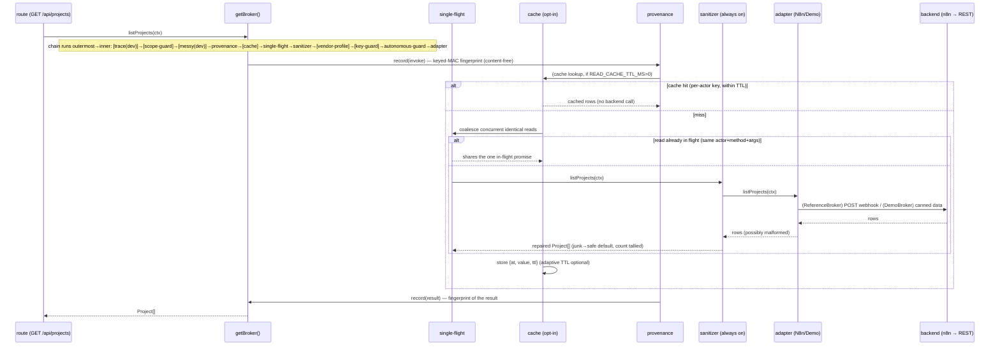
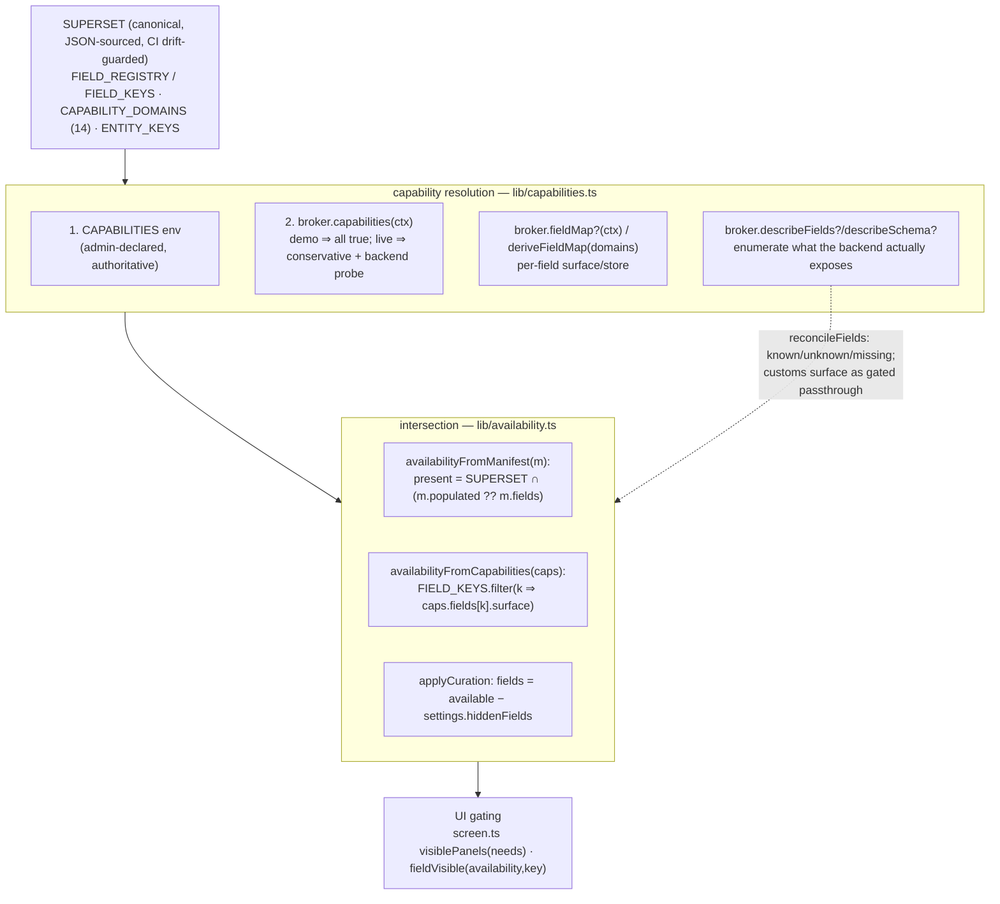
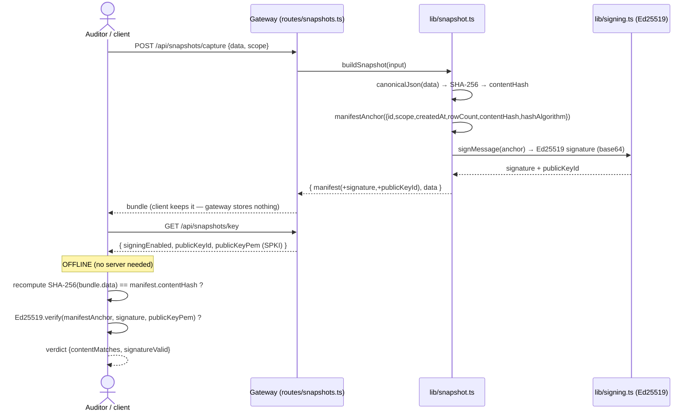
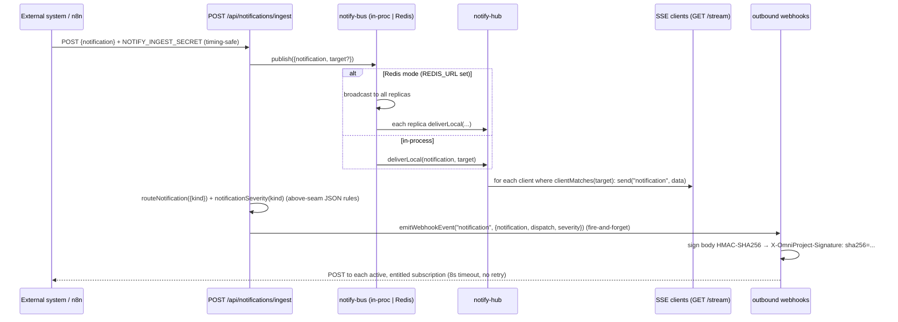
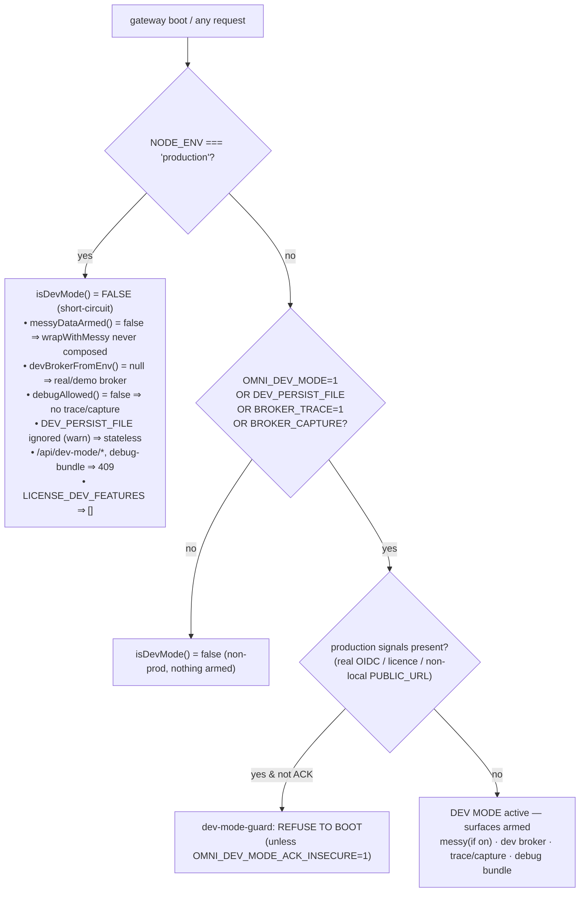

# OmniProject — Key sequences (traced against the code)

> Seven walkthroughs of the real request paths, each a Mermaid sequence diagram
> plus prose that names the exact files and functions. Read
> [ARCHITECTURE.md](ARCHITECTURE.md) first for the layer cake and the seam. Where a
> path differs between the demo and live (n8n) adapters, both are described.

Contents:

1. [Auth / session establishment](#1-auth--session-establishment)
2. [A broker READ through the decorator chain](#2-a-broker-read-through-the-decorator-chain)
3. [A WRITE with optimistic-concurrency write-through](#3-a-write-with-optimistic-concurrency-write-through)
4. [Capability / field resolution (superset ∩ manifest)](#4-capability--field-resolution-superset--manifest)
5. [Provably-immutable snapshot: sign + offline verify](#5-provably-immutable-snapshot-sign--offline-verify)
6. [Notification dispatch above the seam](#6-notification-dispatch-above-the-seam)
7. [Dev-mode + messy-data gating (prod-inert)](#7-dev-mode--messy-data-gating-prod-inert)

---

## 1. Auth / session establishment

**Files:** [`routes/auth.ts`](../artifacts/api-server/src/routes/auth.ts),
[`lib/oidc.ts`](../artifacts/api-server/src/lib/oidc.ts),
[`lib/session-crypto.ts`](../artifacts/api-server/src/lib/session-crypto.ts),
[`lib/session-key.ts`](../artifacts/api-server/src/lib/session-key.ts),
[`lib/csrf.ts`](../artifacts/api-server/src/lib/csrf.ts),
[`lib/rbac.ts`](../artifacts/api-server/src/lib/rbac.ts).

```mermaid
sequenceDiagram
  actor U as Browser
  participant G as Gateway (routes/auth.ts)
  participant O as lib/oidc.ts
  participant IdP
  participant SC as lib/session-crypto.ts

  U->>G: GET /api/auth/login?returnTo=...
  Note over G: safeLocalPath(returnTo) — no open redirect
  alt OIDC configured
    G->>O: discover(provider)  (cached 10m)
    G->>G: mint state + PKCE verifier + nonce (randomToken)
    G-->>U: Set-Cookie omni_oidc_flow (signed, 10m) + 302 to authorizeUrl()
    U->>IdP: Authorization Code + PKCE (S256) + nonce
    IdP-->>U: 302 back with ?code&state
    U->>G: GET /api/auth/callback?code&state
    G->>G: read+clear flow cookie; check state
    G->>O: exchangeCode(code, verifier, redirect_uri)
    O-->>G: id_token + access_token
    G->>O: verifyIdToken (JWKS sig, iss/aud/exp) ; idTokenNonce == flow nonce
    G->>O: decodeIdTokenClaims → sub/name/email/roles
  else Demo mode (no OIDC vars)
    Note over G: setSession({sub:"demo-user", accessToken:"demo-token"})
  end
  G->>SC: setSession → seal(JSON) AES-256-GCM (HKDF key from SESSION_SECRET)
  G-->>U: Set-Cookie omni_session (httpOnly, signed, sealed, 8h) + fresh CSRF cookie
  U->>G: subsequent GET /api/projects (cookie auto-sent)
  G->>G: getSession(req) → readSession → open() ; idle/absolute/kver/revocation checks
  G->>G: roleForReq(req) via lib/rbac (claims → grants)
```

**Prose.** `GET /api/auth/login` (auth.ts) sanitises `returnTo` with
`safeLocalPath()`, then either (a) mints `state`/`verifier`/`nonce`, stows them in a
signed 10-minute `omni_oidc_flow` cookie, and redirects to `authorizeUrl()`
(Authorization Code + **S256 PKCE** + nonce), or (b) in **demo mode** (no `OIDC_*`)
issues a local session immediately. On `GET /api/auth/callback` the gateway checks
`state`, calls `exchangeCode()`, cryptographically verifies the ID token against the
issuer JWKS (`verifyIdToken`), confirms the token's nonce matches the flow nonce
(replay defence), and decodes claims.

`setSession()` stamps `iat`, `seen`, key version `kver`, a monotonic session start
`smono` and a random `salt`, then **seals** the JSON with AES-256-GCM under an
HKDF-derived key (`seal()` in `session-crypto.ts`) and writes the `omni_session`
cookie: `httpOnly`, `signed`, `sameSite=lax`, `secure` (TLS-aware), 8h max-age. The
`smono`+`salt` are the binding material for the **per-session broker signing key**
(`deriveSessionBrokerKey`, `session-key.ts`) — see sequences 2 and 3.

On every later request, `getSession(req)` → `readSession(req)` reads the signed
cookie, `open()`s it, and enforces idle + absolute timeout, key-version revocation,
per-user revocation, and the concurrent-session cap
([`session-registry.ts`](../artifacts/api-server/src/lib/session-registry.ts)).
`roleForReq()` maps IdP group claims to RBAC grants (base ladder
viewer→contributor→manager plus orthogonal PMO/admin authorities). SAML
([`lib/saml.ts`](../artifacts/api-server/src/lib/saml.ts), install-on-demand) and
non-OIDC OAuth2 ([`lib/oauth2.ts`](../artifacts/api-server/src/lib/oauth2.ts)) reach
the *same* `setSession` + role-map. **CSRF** ([`lib/csrf.ts`](../artifacts/api-server/src/lib/csrf.ts))
guards cookie-authenticated mutations with an Origin/Referer check **and** a
double-submit `omni_csrf` token; a fresh token is issued on every login. **Step-up**
([`lib/step-up.ts`](../artifacts/api-server/src/lib/step-up.ts)) re-auth (5-minute
freshness, OIDC `prompt=login`) gates the highest-risk admin actions.

---

## 2. A broker READ through the decorator chain

**Files:** [`routes/projects.ts`](../artifacts/api-server/src/routes/projects.ts),
[`lib/data.ts`](../artifacts/api-server/src/lib/data.ts),
[`broker/index.ts`](../artifacts/api-server/src/broker/index.ts) and the decorators
in [`broker/`](../artifacts/api-server/src/broker/).



**Prose.** Route handlers never touch an adapter; the facade
[`lib/data.ts`](../artifacts/api-server/src/lib/data.ts) calls
`getBroker().listProjects(contextFromReq(req))`. `contextFromReq`
([`broker/index.ts`](../artifacts/api-server/src/broker/index.ts)) builds the
`ActorContext` from the validated session (sub/email/role/token + `sessionBind`).

The call passes through the `Proxy` chain composed once in `getBroker()`:

- **provenance** ([`broker/provenance.ts`](../artifacts/api-server/src/broker/provenance.ts))
  records an `invoke` fingerprint before the call and a `result`/`error`
  fingerprint after — content-free keyed-MACs (see
  [`lib/provenance.ts`](../artifacts/api-server/src/lib/provenance.ts)). Being
  *outside* the cache, it records every logical call even on a cache hit.
- **cache** ([`broker/cache.ts`](../artifacts/api-server/src/broker/cache.ts)),
  only if `READ_CACHE_TTL_MS > 0`, keyed per-actor (`sub`/`email`) + method + args.
  A hit within TTL returns immediately; otherwise it falls through, and on success
  stores the value with the TTL chosen at fetch time (adaptive per-method TTL is
  optional via [`adaptive-ttl.ts`](../artifacts/api-server/src/broker/adaptive-ttl.ts)).
- **single-flight** ([`broker/single-flight.ts`](../artifacts/api-server/src/broker/single-flight.ts)),
  always on. If an identical read (same `actorKey:method:args`) is already in
  flight, all callers share that one promise — introducing no staleness — which
  collapses "N users open the same dashboard ⇒ N backend calls" to one.
- **sanitizer** ([`broker/sanitizer.ts`](../artifacts/api-server/src/broker/sanitizer.ts)),
  always on and *inner to the cache*, so the repair happens once and clean data is
  what gets cached. It coerces every backend row to the contract shape (junk number →
  safe default, missing required string → `""`, canonical enums) and strips
  prototype-pollution keys from untyped rows, tallying repairs for the data-quality
  signal. This is why the dev-only **messy** wrap sits *outside* it — to re-dirty the
  payload for resilience tests.
- The **adapter** then serves it: `DemoBroker` from canned data,
  `ReferenceBroker` by POSTing the webhook envelope and normalising the response.
  Below the adapter, two always-/first-party guards complete the chain but are inert
  for an ordinary read: **key-guard** (blocks a keyless request to a live vendor) and
  the innermost **autonomous-guard** (binds autonomous-actor *writes* to their grant).

In dev builds the outermost wraps are **messy** (injects dirty data into reads, §7)
and **trace** (logs `→`/`←` with timing); both are absent in production. For the
first-party brokers, an outer **scope-guard** ([`broker/scope-guard.ts`](../artifacts/api-server/src/broker/scope-guard.ts))
re-enforces the caller's data scope (covering even a cache hit).

---

## 3. A WRITE with optimistic-concurrency write-through

**Files:** [`routes/projects.ts`](../artifacts/api-server/src/routes/projects.ts),
[`broker/types.ts`](../artifacts/api-server/src/broker/types.ts),
[`lib/concurrency.ts`](../artifacts/api-server/src/lib/concurrency.ts),
[`broker/demo.ts`](../artifacts/api-server/src/broker/demo.ts),
[`broker/reference-broker/`](../artifacts/api-server/src/broker/reference-broker/),
[`broker/cache.ts`](../artifacts/api-server/src/broker/cache.ts),
[`broker/index.ts`](../artifacts/api-server/src/broker/index.ts).

```mermaid
sequenceDiagram
  actor U as SPA
  participant R as route (PATCH /api/projects/:p/issues/:i)
  participant BR as business rules
  participant B as getBroker()
  participant C as cache decorator
  participant A as adapter
  participant BE as backend

  U->>R: PATCH {expectedVersion: 42, ...patch}
  R->>R: requireRole("contributor")
  R->>BR: passesBusinessRules(req, "update_issue", ...) (restrict-only)
  R->>B: writeIssue(ctx, "update", {projectId, issueId, expectedVersion:42, ...patch})
  Note over C: WRITE_METHODS ⇒ clear() first (write-through: drop stale reads)
  B->>A: writeIssue(...)
  alt DemoBroker (checks locally)
    A->>A: versionConflict(42, current.version)?
    alt conflict
      A-->>R: throw BrokerError("conflict", ..., current)
    else ok
      A->>A: {...current, ...patch, version: current+1, updatedAt}
      A-->>R: updated Issue (version 43)
    end
  else ReferenceBroker (forwards; backend enforces)
    A->>BE: POST update_issue (expectedVersion in payload; idempotencyKey; origin loop-guard)
    BE-->>A: 200 Issue  |  409 (backend lockVersion mismatch)
    A-->>R: Issue  |  BrokerError.fromStatus(409)
  end
  alt conflict
    R->>R: respondBrokerError → 409 { error, current }
    R-->>U: 409 + current server state (no clobber)
  else success
    R-->>U: 200 Issue
  end
```

**Prose.** `PATCH /api/projects/:projectId/issues/:issueId` (projects.ts) is gated by
`requireRole("contributor")`, then by the **restrict-only** business ruleset
(`passesBusinessRules`, [`lib/ruleset.ts`](../artifacts/api-server/src/lib/ruleset.ts) —
it can deny/warn, never grant), then calls
`getBroker().writeIssue(contextFromReq(req), "update", { projectId, issueId, ...body })`.
The domain method is `writeIssue(ctx, "create"|"update"|"delete", input)`
([`broker/types.ts`](../artifacts/api-server/src/broker/types.ts)); the concurrency
token is `IssueWrite.expectedVersion` in, `Issue.version` out.

**Write-through:** the cache decorator's `WRITE_METHODS`
([`broker/cache.ts`](../artifacts/api-server/src/broker/cache.ts)) includes
`writeIssue`, so a write `clear()`s the cache before executing — a change you make is
immediately visible. The generic command path also calls `invalidateReadCache()`.

**Optimistic concurrency** is the shared rule `versionConflict(expected, current)`
([`lib/concurrency.ts`](../artifacts/api-server/src/lib/concurrency.ts)):
`true` iff `expectedVersion` is present and differs from the current version. The
**`DemoBroker`** ([`broker/demo.ts`](../artifacts/api-server/src/broker/demo.ts))
checks locally: on conflict it throws `BrokerError("conflict", …, currentIssue)`;
otherwise it merges the patch and **increments `version`**. The **`ReferenceBroker`** maps
`op` → `"${op}_issue"`, forwards the full input (including `expectedVersion`) with an
`idempotencyKey` (`sha256(action:projectId:issueId:minute)`) and the
`origin=omniproject` **loop-guard** header, and lets the backend enforce concurrency
(e.g. OpenProject `lockVersion`), surfacing a backend `409` via
`BrokerError.fromStatus(409)`.

`respondBrokerError()` ([`broker/index.ts`](../artifacts/api-server/src/broker/index.ts))
maps the error taxonomy to HTTP: `conflict → 409`, and for a conflict attaches
`current` (the server's current state) to the body — so the SPA can show the fresh
state instead of clobbering it. (Note: the demo adapter attaches the current row as
`details`; the live n8n adapter maps the backend's `409` status and does not itself
re-parse the upstream body into `details`.)

---

## 4. Capability / field resolution (superset ∩ manifest)

**Files:** [`lib/capabilities.ts`](../artifacts/api-server/src/lib/capabilities.ts),
[`lib/availability.ts`](../artifacts/api-server/src/lib/availability.ts),
[`lib/field-registry.ts`](../artifacts/api-server/src/lib/field-registry.ts),
[`routes/capabilities.ts`](../artifacts/api-server/src/routes/capabilities.ts),
[`broker/types.ts`](../artifacts/api-server/src/broker/types.ts),
[FIELD-CATALOGUE.md](FIELD-CATALOGUE.md).



**Prose.** The **superset** is the canonical vocabulary authored as JSON
(`lib/backend-catalogue/assets/fields.json` → `FIELD_REGISTRY`) plus the 14
`CAPABILITY_DOMAINS` (`issues, scheduling, resources, financials, portfolio,
baseline, blockers, history, raid, quality, crm, service, benefits`) and
`ENTITY_KEYS` — all drift-guarded in CI so backend and SPA can't diverge.

`resolveCapabilities(req)` ([`lib/capabilities.ts`](../artifacts/api-server/src/lib/capabilities.ts))
resolves in order: (1) the `CAPABILITIES` env var if set (authoritative); else
(2) the active broker's `capabilities(ctx)` — the **`DemoBroker` enables every
domain**, a live `ReferenceBroker` starts from a **conservative** flag set and merges what
the backend's probe reports. `deriveFieldMap()` turns coarse domain flags into a
per-field `{surface, store}` map via `GROUP_DOMAIN` (each field group → its gating
domain; derived/rolled-up fields are read-only), which a broker can override with an
explicit `fieldMap`.

The **manifest ∩ superset** intersection lives in
[`lib/availability.ts`](../artifacts/api-server/src/lib/availability.ts):
`availabilityFromManifest()` keeps only `SUPERSET ∩ (m.populated ?? m.fields)` in
stable superset order (honouring "surface only what is populated"); the fallback
`availabilityFromCapabilities()` derives the surfaced set from the flags. Admin/PMO
**curation** then subtracts `settings.hiddenFields`. The **describe → reconcile**
path (`reconcileFields`, [`lib/field-registry.ts`](../artifacts/api-server/src/lib/field-registry.ts))
diffs the backend's enumerated fields against the registry into
known / unknown / missing, surfacing non-canonical fields as gated passthrough
(`customFields`) without a registry edit. Connected **brokers** contribute their own
capability keys (`synchronous`, `eventsOutbound`, …), OR-unioned into one flat
`resolveSupport()` map, so an asset can require a broker capability and light up only
when a broker supports it. The SPA gates panels/fields on the resolved set
(`screen.ts` `visiblePanels`, `availability.ts` `fieldVisible`). Endpoints:
`GET /api/capabilities`, `GET /api/availability`, `GET /api/fields/manifest`.

---

## 5. Provably-immutable snapshot: sign + offline verify

**Files:** [`lib/snapshot.ts`](../artifacts/api-server/src/lib/snapshot.ts),
[`routes/snapshots.ts`](../artifacts/api-server/src/routes/snapshots.ts),
[`lib/signing.ts`](../artifacts/api-server/src/lib/signing.ts),
[`lib/provenance.ts`](../artifacts/api-server/src/lib/provenance.ts),
[`lib/audit-chain.ts`](../artifacts/api-server/src/lib/audit-chain.ts).



**Prose.** `POST /api/snapshots/capture`
([`routes/snapshots.ts`](../artifacts/api-server/src/routes/snapshots.ts)) calls
`buildSnapshot()` ([`lib/snapshot.ts`](../artifacts/api-server/src/lib/snapshot.ts)):
it canonicalises the data (sorted-key JSON for a stable hash), takes its
**SHA-256** `contentHash`, builds a deterministic **manifest anchor**
(`{id, scope, createdAt, rowCount, contentHash, hashAlgorithm}`), and **Ed25519**-signs
that anchor (`signMessage`, [`lib/signing.ts`](../artifacts/api-server/src/lib/signing.ts),
key from `SIGNING_PRIVATE_KEY`; signing is optional and disabled if unset). The
bundle (manifest + signature + data) is returned to the client — **the gateway
stores nothing** (zero-at-rest holds).

**Offline verification** needs only the bundle and the public key from
`GET /api/snapshots/key` (SPKI PEM): recompute the SHA-256 of the data and compare to
`manifest.contentHash` (content integrity), then verify the Ed25519 signature over
the re-derived manifest anchor (authenticity + non-repudiation). `verifySnapshot()`
implements exactly this and is pure/stateless, so an auditor can run it anywhere
(there is also `POST /api/snapshots/verify` for convenience).

**Related tamper-evidence.** The **provenance chain**
([`lib/provenance.ts`](../artifacts/api-server/src/lib/provenance.ts)) and the durable
**audit chain** ([`lib/audit-chain.ts`](../artifacts/api-server/src/lib/audit-chain.ts))
are hash-linked keyed-MAC chains whose tips are exposed as Ed25519-signed **anchors**
(`provenanceAnchor()`, `auditAnchor()`), each offline-verifiable the same way. Two
standalone Node verifiers ship for auditors:
`artifacts/api-server/tools/verify-audit-chain.mjs` (verifies an NDJSON audit export
shipped to a SIEM) and `tools/decrypt-config-bundle.mjs` (opens an exported config
bundle with its one-time ephemeral key). Both run without the server.

---

## 6. Notification dispatch above the seam

**Files:** [`routes/notifications-stream.ts`](../artifacts/api-server/src/routes/notifications-stream.ts),
[`lib/notify-bus.ts`](../artifacts/api-server/src/lib/notify-bus.ts),
[`lib/notify-hub.ts`](../artifacts/api-server/src/lib/notify-hub.ts),
[`lib/sse.ts`](../artifacts/api-server/src/lib/sse.ts),
[`lib/webhooks.ts`](../artifacts/api-server/src/lib/webhooks.ts),
[`lib/redis-bus.ts`](../artifacts/api-server/src/lib/redis-bus.ts).



**Prose.** This channel lives **entirely above the broker seam** — it is the
gateway's own live push path, distinct from `broker.notifications(ctx)` (which
*reads* persisted notification history from the backend via `GET /api/notifications`).

External systems (n8n workflows, tools) `POST /api/notifications/ingest`
([`routes/notifications-stream.ts`](../artifacts/api-server/src/routes/notifications-stream.ts)),
authenticated by `NOTIFY_INGEST_SECRET` (constant-time compare). The handler
`publish()`es to the **notify-bus** ([`lib/notify-bus.ts`](../artifacts/api-server/src/lib/notify-bus.ts)):
in-process by default, or fanned across replicas via Redis Pub/Sub when `REDIS_URL`
is set ([`lib/redis-bus.ts`](../artifacts/api-server/src/lib/redis-bus.ts), with
graceful fallback if `ioredis` is absent). Each replica's **notify-hub**
([`lib/notify-hub.ts`](../artifacts/api-server/src/lib/notify-hub.ts)) delivers to
its connected **SSE** clients ([`lib/sse.ts`](../artifacts/api-server/src/lib/sse.ts),
`GET /api/notifications/stream`), targeting by `sub`/`email`/`role` (empty target =
broadcast) with a 25-second keepalive that also enforces live SCIM deprovisioning.

In parallel, the ingest handler computes a routing decision (`routeNotification`, JSON
rules in the backend-catalogue, gated on channel availability) and a canonical
severity, then **fire-and-forget** fans an outbound **webhook** event
(`emitWebhookEvent("notification", …)`, [`lib/webhooks.ts`](../artifacts/api-server/src/lib/webhooks.ts)).
Each delivery is **HMAC-SHA256** signed (`X-OmniProject-Signature: sha256=<hex>`,
`signBody`), carries `X-OmniProject-Event`/`-Delivery` headers, has an 8-second
timeout and **no retry queue** (for at-least-once, target an n8n webhook and let n8n
queue retries). Only `active`, event-matching, **entitled** (`webhooks` licence)
subscriptions receive it.

---

## 7. Dev-mode + messy-data gating (prod-inert)

**Files:** [`lib/dev-mode.ts`](../artifacts/api-server/src/lib/dev-mode.ts),
[`lib/dev-mode-guard.ts`](../artifacts/api-server/src/lib/dev-mode-guard.ts),
[`lib/messy-data.ts`](../artifacts/api-server/src/lib/messy-data.ts),
[`broker/messy-broker.ts`](../artifacts/api-server/src/broker/messy-broker.ts),
[`broker/index.ts`](../artifacts/api-server/src/broker/index.ts).



**Prose.** The single source of truth is `isDevMode()`
([`lib/dev-mode.ts`](../artifacts/api-server/src/lib/dev-mode.ts)): its first line is
`if (!notProd()) return false;`, so **production short-circuits every dev surface**.
Outside production it is true only when the master switch `OMNI_DEV_MODE=1` is set or a
debug surface is armed (`DEV_PERSIST_FILE`, `BROKER_TRACE=1`, `BROKER_CAPTURE`).

Because the dev decorators are **composed conditionally** in `getBroker()`, a stray
env var cannot enable them in production:

- `messyDataArmed()` (`isDevMode() && getMessyConfig().on`) gates `wrapWithMessy`
  ([`broker/messy-broker.ts`](../artifacts/api-server/src/broker/messy-broker.ts)),
  which passes READ results through the **gremlin catalogue**
  ([`lib/messy-data.ts`](../artifacts/api-server/src/lib/messy-data.ts): nullify,
  dropField, enum-casing, number/currency/date chaos, unicode stress, missing source,
  duplicate ids …) to stress-test derivations against dirty data. Writes are never
  touched and the backing store is never mutated (a shallow copy on the way out).
- `debugAllowed()` (`NODE_ENV !== "production"`) gates trace + capture
  ([`broker/trace.ts`](../artifacts/api-server/src/broker/trace.ts)); a CI guard
  asserts neither fires in a released build.
- `devBrokerFromEnv()` returns null outside dev, so the vendor-spoof `DevBroker` is
  never selected in production.
- `DEV_PERSIST_FILE` is ignored under `NODE_ENV=production` with a warning
  ([`lib/dev-persist.ts`](../artifacts/api-server/src/lib/dev-persist.ts)), keeping
  the deployment stateless; `/api/dev-mode/*` routes and the debug bundle return `409`.

Finally, the **boot interlock** `runDevModeGuard`
([`lib/dev-mode-guard.ts`](../artifacts/api-server/src/lib/dev-mode-guard.ts))
refuses to boot if dev mode is armed on an environment that *looks* like production
(real OIDC, a licence, a non-local `PUBLIC_URL`), unless
`OMNI_DEV_MODE_ACK_INSECURE=1` downgrades it to a loud warning.

---

## See also

- [ARCHITECTURE.md](ARCHITECTURE.md) — the system overview and the seam.
- [READING-GUIDE.md](READING-GUIDE.md) — subsystem → entry-point map + glossary.
- [BROKER.md](BROKER.md) · [CONTRACT.md](CONTRACT.md) · [AI-SECURITY.md](AI-SECURITY.md).
- [FUNCTION-MAP.md](FUNCTION-MAP.md) — the generated per-function index.
</content>
